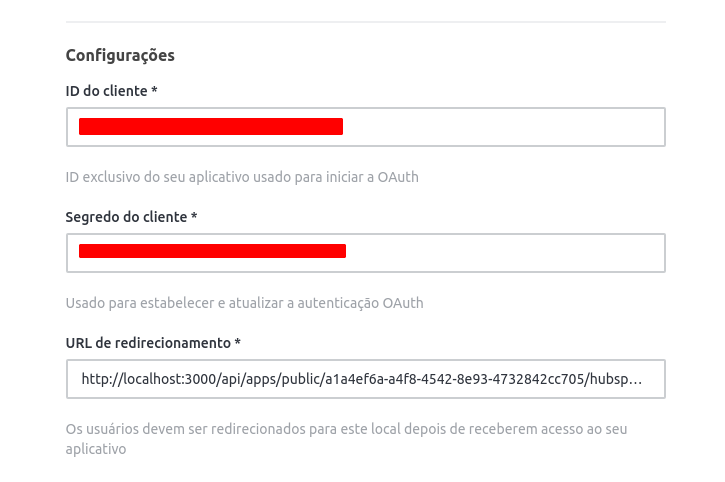
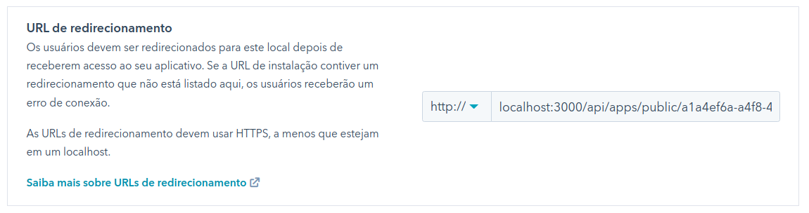

# Integração Hubspot
Realiza integração com o Hubspot manipulando contatos e negócios

## Objetivo

Esse projeto foi criado para ser ponto de partida para live [**Integrando o Rocket.Chat com um CRM**](https://4linux.com.br/cursos/lp/integrando-rocket-chat-com-crm/).

Inicialmente o seu único objetivo é realizar toda a tarefa necessário para autenticação junto ao Hubspot utilizando OAuth ([Entenda mais sobre o OAuth no Hubspot](https://developers.hubspot.com/docs/api/oauth-quickstart-guide)).

Para faze-lo funcionar é necessário possuir um aplicativo criado no Hubspot e seus dados sejam definidos na configuração do App no Rocket.Chat.

## Requisitos

* [Conta de desenvolvedor](https://app.hubspot.com/signup/developers)
* [Um aplicativo do Hubspot](https://developers.hubspot.com/docs/api/creating-an-app) associado com a conta de desenvolvedor.
* Uma conta no Hubspot onde você irá instalar o aplicativo (Você pode [criar uma conta de testes](https://developers.hubspot.com/docs/api/creating-test-accounts) como desenvolvedor)

## APIs disponibilizadas

* GET [hubspot/oauth](http://localhost:3000/api/apps/public/a1a4ef6a-a4f8-4542-8e93-4732842cc705/hubspot/oauth) - URL de redirecionamento do aplicativo do Hubspot para realizar a autenticação inicial.
* PUT [hubspot/oauth](http://localhost:3000/api/apps/public/a1a4ef6a-a4f8-4542-8e93-4732842cc705/hubspot/oauth) - Renovar autenticação com o Hubspot caso tenha expirado (Essa tarefa já é realizada automaticamente antes de utilizar o token em uma chamada).
* GET [hubspot/user](http://localhost:3000/api/apps/public/a1a4ef6a-a4f8-4542-8e93-4732842cc705/hubspot/user) - Faz uma busca de usuários no Hubspot por e-mail baseado no valor passado no parametro de query **email**.

## Utilizando

Após instalação do App no Rocket, é necessário configura-lo com os dados do aplicativo do Hubspot:

Em seguida, configurar a URL de redirecionamento do aplicativo Hubspot para apontar para a API do Rocket.Chat:

